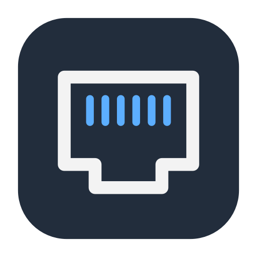

# MyPorts

[English](#english) · [Español](#español)

## English

Your local services, within reach. **MyPorts** is a lightweight native macOS dashboard that shows listening TCP ports, the processes behind them and their uptime. Open a service or stop its process from a card.

**[Download MyPorts for macOS](https://github.com/angelmaciasr/myports/releases/latest/download/MyPorts-macos-universal.zip)** · [All releases](https://github.com/angelmaciasr/myports/releases)

**macOS 13 Ventura or later** · **Apple Silicon and Intel** · English interface · No Node, Python or server required to run the app.

### Install

1. Download and unzip the archive.
2. Drag **MyPorts.app** into **Applications**.
3. Open it with a double-click or Spotlight. Click its Ethernet icon in the menu bar to open the dashboard.

#### First launch

This release is **ad hoc signed**, without an Apple Developer ID signature or Apple notarization. macOS may block its first launch after downloading it from the Internet.

If you trust the source and this download, attempt to open the app, then go to **System Settings → Privacy & Security → Open Anyway** and confirm. See [Apple’s safe app opening guide](https://support.apple.com/en-us/102445). You do not need to disable system protections.

### Features

- Services appear and disappear automatically while the dashboard is open.
- Search by port, process, PID, address or folder; filter by **All**, **Projects** or **Apps**.
- Cards show ports, addresses, process IDs, working folders, start dates and uptime.
- Open HTTP/HTTPS, copy URLs and reveal project folders in Finder.
- **Stop** asks for confirmation and sends `SIGTERM`. If the process is still running after four seconds, **Force quit…** allows `SIGKILL` with another confirmation.
- Choose a refresh interval of **1, 2, 5 or 10 seconds** and enable **Launch at login** in settings. Automatic launch is off by default.

**⌘W** minimizes the window. The close button hides it. Both pause scanning. Right-click the menu bar icon → **Quit** to exit the app completely.

### Lightweight and local

Built with **Swift, AppKit and C**, MyPorts reads process and socket information directly through `libproc`. It does not launch `lsof`, scan network ports or make requests to your services. Scanning pauses when the dashboard is hidden or minimized. There is no background server, telemetry, account or process history.

A development measurement put the detector at about **2.3 ms of CPU per scan**. Actual usage varies with process count and refresh interval. Hover effects use native mouse events without extra timers.

### How services are interpreted

- Shows **listening TCP sockets**, including IPv4 and IPv6. Addresses belonging to the same process and port are grouped. UDP and outgoing TCP connections are excluded.
- **Since** is the process start time, which may precede the time it opened the port.
- A listening port may belong to a database or another non-web service. **Open** is useful when it speaks HTTP or HTTPS.
- Stopping a process affects **all its ports**. A supervisor or Docker may restart it.
- Before signaling, the app rechecks ownership, PID, start time and listening port to guard against reused process IDs.
- Only your user’s processes can be stopped; system processes are protected and hidden initially. macOS may prevent inspection of other users’ processes.
- A listening port is not necessarily reachable from the Internet. That depends on its address, firewall and network.

### Build from source

Requires macOS and **Apple Command Line Tools**. The compiled app has no development tool dependencies.

```sh
xcode-select --install
git clone https://github.com/angelmaciasr/myports.git
cd myports
./build.sh
```

This produces the universal app at `build/MyPorts.app`. Drag it into Applications, or run `./install.sh` to install it in `~/Applications` and create a desktop shortcut. Deleting the shortcut does not delete the app. The installer does not enable launch at login.

Run `./package.sh` to build the downloadable ZIP and SHA-256 checksum.

### Tests

After building, with Python 3 available:

```sh
python3 -m unittest discover -s tests -v
```

Tests use disposable child processes to verify detection, disappearance, working directories with spaces and accents, IPv4/IPv6 grouping, UDP exclusion, graceful and forced shutdown, and stale identity rejection. They do not stop existing services.

To benchmark the detector:

```sh
xcrun clang -O2 tests/benchmark.c build/PortScanner.o -o build/benchmark
./build/benchmark
```

The app exposes `--list` for JSON output and `--stop PID START_SEC START_USEC PORT [--force]` for tests. Stopping does not run shell commands.

### License

[MIT](LICENSE). Use, modify and distribute it.

---

## Español

Tus servicios locales, a mano. **MyPorts** es un dashboard nativo y ligero para macOS que muestra los puertos TCP en escucha, los procesos que los usan y su tiempo activo. Abre el servicio o detén el proceso desde su tarjeta.

**[Descargar MyPorts para macOS](https://github.com/angelmaciasr/myports/releases/latest/download/MyPorts-macos-universal.zip)** · [Todas las versiones](https://github.com/angelmaciasr/myports/releases)

**macOS 13 Ventura o posterior** · **Apple Silicon e Intel** · Interfaz en inglés · Sin Node, Python ni servidores para usarla.

### Instalar

1. Descarga el ZIP y descomprímelo.
2. Arrastra **MyPorts.app** a **Aplicaciones**.
3. Ábrela con doble clic o Spotlight. Pulsa su icono de Ethernet en la barra de menú para abrir el dashboard.

#### Primera apertura

Esta versión tiene **firma local ad hoc**, pero no firma Developer ID ni notarización de Apple. macOS puede bloquear la primera apertura al descargarla de Internet.

Si confías en el código y en esta descarga, intenta abrir la app y después ve a **Ajustes del Sistema → Privacidad y seguridad → Abrir igualmente**. Confirma la apertura. Consulta la [guía de Apple para abrir apps de forma segura](https://support.apple.com/es-es/102445). No hace falta desactivar las protecciones del sistema.

### Funciones

- Los servicios aparecen y desaparecen automáticamente mientras el dashboard está abierto.
- Busca por puerto, proceso, PID, dirección o carpeta; filtra con **All**, **Projects** o **Apps**.
- Cada tarjeta muestra el puerto, las direcciones, el PID, la carpeta de trabajo, la fecha de inicio y el tiempo activo.
- Abre HTTP/HTTPS, copia URL y muestra carpetas en Finder.
- **Stop** pide confirmación y envía `SIGTERM`. Si el proceso sigue vivo después de cuatro segundos, **Force quit…** permite enviar `SIGKILL` con otra confirmación.
- Elige un intervalo de **1, 2, 5 o 10 segundos** y activa **Launch at login** desde los ajustes. El inicio automático está desactivado de fábrica.

**⌘W** minimiza la ventana. El botón de cierre la oculta. Ambas acciones pausan las consultas. Clic derecho en el icono de la barra de menú → **Quit** cierra la app por completo.

### Ligera y local

Hecha con **Swift, AppKit y C**, consulta procesos y sockets directamente con `libproc`. No lanza `lsof`, escanea puertos ni hace peticiones a tus servicios. Las consultas se pausan cuando el dashboard está oculto o minimizado. No tiene servidor propio, telemetría, cuentas ni historial de procesos.

En una medición de desarrollo, el detector necesitó unos **2,3 ms de CPU por consulta**. El consumo varía con el número de procesos y el intervalo. El hover usa eventos nativos de ratón, sin temporizadores adicionales.

### Cómo interpreta los servicios

- Muestra **TCP en escucha**, tanto IPv4 como IPv6. Agrupa las direcciones del mismo proceso y puerto. No muestra UDP ni conexiones TCP salientes.
- **Since** indica el inicio del proceso, que puede ser anterior al momento en que abrió ese puerto.
- Un puerto puede pertenecer a una base de datos u otro servicio sin página web. **Open** sirve cuando habla HTTP o HTTPS.
- Detener un proceso afecta a **todos sus puertos**. Un supervisor o Docker puede volver a levantarlo.
- Antes de detenerlo, se revalidan el propietario, el PID, el inicio del proceso y el puerto para evitar actuar sobre un PID reutilizado.
- Solo se pueden detener procesos de tu usuario. Los del sistema están protegidos y ocultos inicialmente. macOS puede impedir consultar procesos de otros usuarios.
- Un puerto en escucha no implica que esté expuesto a Internet; depende de la dirección, el firewall y la red.

### Compilar desde el código

Necesitas macOS y las **Command Line Tools de Apple**. La app compilada no depende de herramientas de desarrollo.

```sh
xcode-select --install
git clone https://github.com/angelmaciasr/myports.git
cd myports
./build.sh
```

Se genera la app universal en `build/MyPorts.app`. Arrástrala a Aplicaciones o ejecuta `./install.sh` para instalarla en `~/Applications` y crear un acceso en el escritorio. Borrar ese acceso no borra la app. El instalador no activa el inicio automático.

Ejecuta `./package.sh` para generar el ZIP y su checksum SHA-256.

### Pruebas

Después de compilar, con Python 3 disponible:

```sh
python3 -m unittest discover -s tests -v
```

Las pruebas usan procesos desechables para verificar detección, desaparición, carpetas con espacios y acentos, agrupación IPv4/IPv6, exclusión de UDP, cierre normal y forzado y rechazo de identidades antiguas. No detienen tus servicios existentes.

Para medir el detector:

```sh
xcrun clang -O2 tests/benchmark.c build/PortScanner.o -o build/benchmark
./build/benchmark
```

La app expone `--list` para producir JSON y `--stop PID START_SEC START_USEC PORT [--force]` para las pruebas. La parada no ejecuta órdenes en una shell.

### Licencia

[MIT](LICENSE). Puedes usarla, modificarla y distribuirla.
